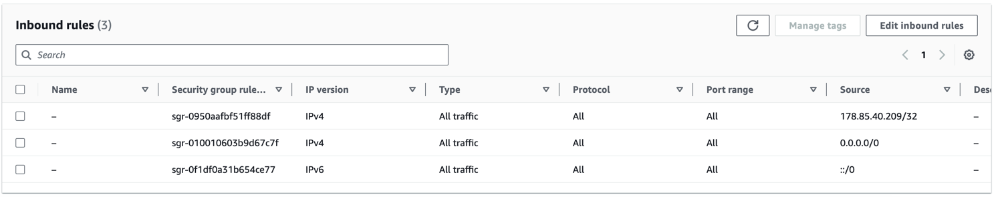
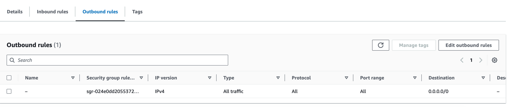

#### Create Local MySql Database instance
```bash
$ docker compose -f user-service-rds-mysql/docker-compose.yaml up mysql
```
#### Build and run user-management project locally
```bash
$ mvn clean install
$ docker compose -f user-service-rds-mysql/docker-compose.yaml up user-service
```

#### Login to AWS Management Console
- **AccountId:** 846374492554
- **IAM user name:** aws-k8s-user
- Go to Services --> RDS --> Select Region **N. Virginia** 
- **Create Database** 
- Database creation method: **Standard create** 
- Engine Options: **MySQL** 
- Templates: **Free tier**
- DB Instance Identifier: **user-management**
- Master username: **admin_user**
- Master password: **mysql-password**
- Public access: **Yes**
- Database authentication: **Password authentication**
- Create Database

> Note: Only specifying `Public Access:Yes` for your Database might not work to get a successful connection from spring boot app. The Security group should allow Inbound traffic from your IP address or All IP addresses.

- Go to **Security Groups:** --> Edit the default security group or create a new one. If you create a new one then attach the same to RDS instance.
- **Inbound rules** --> Edit Inbound rules


- 
- Once the database is ready, note the Endpoint url which we will use as `spring.datasource.url`

#### Build and run user-management project against AWS RDS
```bash
$ cd user-service-rds-mysql/
$ mvn clean install
```

ToDo: Write commands to connect to RDS from command-line.